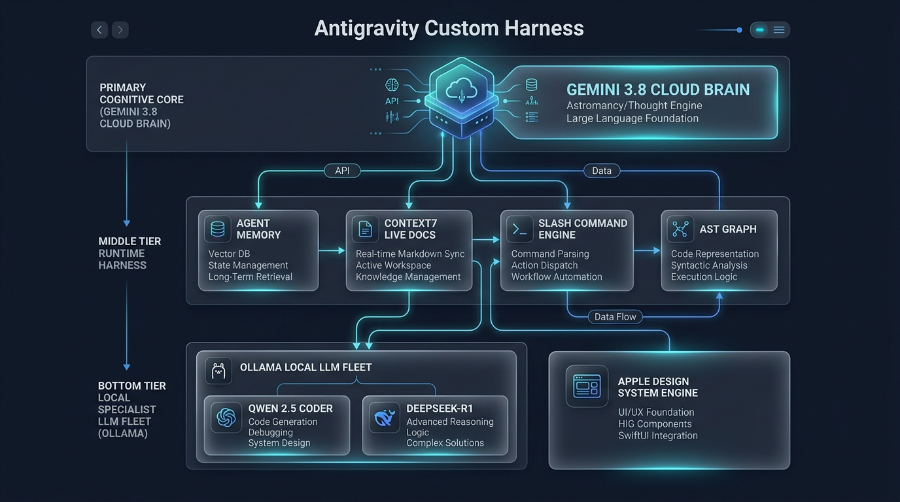
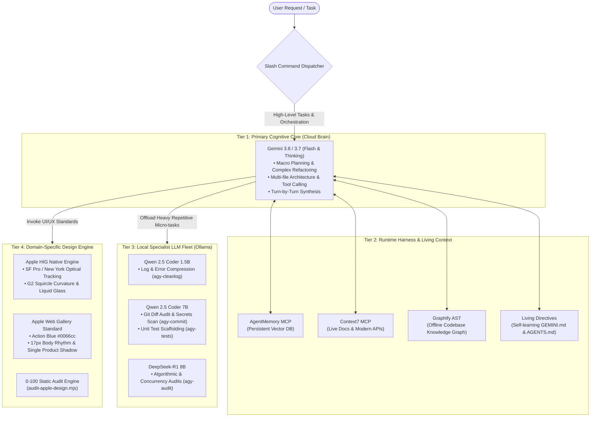

# 🪐 Antigravity Custom Harness Setup

[](LICENSE)
[](https://deepmind.google/technologies/gemini/)
[-orange.svg)](https://ollama.ai)
[](skills/apple-design/SKILL.md)

> A production-grade **Autonomous Multi-Agent Runtime Harness** built on **Google Antigravity**. Integrates a high-capacity Cloud Brain (Gemini 3.8 / 3.7) with a zero-cost local LLM specialist fleet (Ollama), persistent vector memory, real-time API documentation sync, codebase knowledge graphs, and an automated Apple Design & HIG compliance audit engine.

---



---

## 🏛️ System Architecture

Rather than relying on monolithic prompts or naive single-model wrappers, this harness implements a **three-tier cognitive hierarchy**:



---

## ⚡ The 4 Pillars of the Harness

### 1. Hybrid Cloud + Local Model Mesh (80%+ Token Savings)
Noisy terminal output, massive git diffs, and repetitive unit test generation can bloat cloud LLM context windows and waste budget. This harness offloads heavy micro-tasks to an active local **Ollama** sidecar runtime:
- **`agy-cleanlog`** *(Qwen 2.5 Coder 1.5B)*: Strips build noise and progress bars from terminal logs, compressing megabyte-sized error outputs down to <12 lines before pasting to Cloud Gemini.
- **`agy-commit`** *(Qwen 2.5 Coder 7B)*: Scans staged git diffs for forgotten debug statements (`console.log`, `debugger`, raw credentials) and formats clean Conventional Commits.
- **`agy-tests`** *(Qwen 2.5 Coder 7B)*: Rapidly scaffolds unit test boilerplate for any target source file.
- **`agy-audit`** *(DeepSeek-R1 8B)*: Runs adversarial verification on tricky multithreading, mutexes, deadlocks, and race conditions.
- **Auto-Unload Guardrail**: Local models unload after 2 minutes idle (`OLLAMA_KEEP_ALIVE="2m"`) to preserve 100% RAM for system processes.

### 2. Living Self-Learning Directive & Persistent State
- **Self-Evolving Cognitive Files (`GEMINI.md` & `AGENTS.md`)**: The harness enforces an active learning directive. In every session, the agent prunes, refines, and synthesizes newly discovered developer habits, framework edge cases, and architectural fixes directly into its instructions.
- **AgentMemory (`agentmemory` MCP)**: Stores durable facts, architectural decisions, and preferences across sessions.
- **Live Documentation (`Context7` MCP)**: Fetches version-exact, real-time documentation snippets for fast-evolving packages (Next.js, Tailwind, Supabase, LangChain) to eliminate API hallucination.
- **Codebase Knowledge Graph (`Graphify`)**: Converts source code into an offline AST graph (`graphify query`, `graphify path`, `graphify explain`) for instant structural comprehension.

### 3. The Slash Command Spectrum (`/`)
The harness equips the agent with a clean, extensible command palette:
- **`/btw`**: Quick side-questions without interrupting active tasks.
- **`/goal`**: Autonomous completion loop with self-healing test loops.
- **`/schedule`**: Deferred timers and recurring background cron tasks.
- **`/browser`**: Headless browser automation for DOM scraping and live verification.
- **`/grill-me`**: Interactive interview mode to dissect requirements and surface trade-offs before writing code.
- **`/teamwork-preview`**: Parallel subagent fleet running in isolated git worktrees.
- **`/learn`**: Structured reflection to capture reusable lessons.
- **`/boost`**: Deep multi-agent audit mode for high-assurance reasoning.

### 4. Apple Design System & Compliance Audit Engine
The repository packages a unified **Apple Design System Skill** (`skills/apple-design`):
- **Native Apple HIG**: SF Pro / New York optical scales, G2 squircle continuity, dynamic OLED colors, and physical spring physics (`cubic-bezier(0.25, 1, 0.5, 1)`).
- **Apple Web Gallery Standard**: Photography-first museum gallery architecture, pure black global nav (`#000000`), Action Blue accent (`#0066cc`), 17px body reading rhythm (1.47 line-height), and the single signature product surface drop shadow (`rgba(0, 0, 0, 0.22) 3px 5px 30px`).
- **Automated 0–100 Audit CLI (`audit-apple-design.mjs`)**: Static scanner verifying WCAG relative luminance contrast ratios (≥ 4.5:1), touch-target dimensions (≥ 44×44 pt), and flagging forbidden anti-patterns (e.g. purple text on dark backgrounds, un-diffused drop shadows).

---

## 🚀 Quickstart & Setup

### Prerequisites
- [Google Antigravity CLI or IDE](https://antigravity.google)
- [Ollama](https://ollama.ai) (for local LLM sidecars)
- Node.js 18+ (for MCP servers and audit scripts)

### 1. Pull Local Specialist Models
```bash
ollama pull qwen2.5-coder:1.5b
ollama pull qwen2.5-coder:7b
ollama pull deepseek-r1:8b
```

### 2. Install Local Helper Scripts
Add the local helper suite to your shell configuration (`~/.zshrc` or `~/.bashrc`):
```bash
cp scripts/agy-helpers.zsh ~/.local/bin/agy-helpers.zsh
echo 'source ~/.local/bin/agy-helpers.zsh' >> ~/.zshrc
source ~/.zshrc
```

### 3. Configure MCP Servers
Copy the sanitized template to your Antigravity configuration directory:
```bash
cp config/mcp_config.example.json ~/.gemini/config/mcp_config.json
```
Set your environment variables in `~/.zshrc` or `.env`:
```bash
export RENDER_API_KEY="your_key_here"
export AGENTMEMORY_URL="http://localhost:3111"
```

### 4. Run Apple Design Compliance Audit
```bash
node skills/apple-design/scripts/audit-apple-design.mjs [path-to-your-ui-code]
```

---

## 🛡️ Security & Zero-Leak Assurance

This harness was built from the ground up for safe public sharing:
- **No Hardcoded Secrets**: All API keys, bearer tokens, and OAuth keys are substituted with environment variables (`${RENDER_API_KEY}`, `${GOOGLE_API_KEY}`).
- **Sanitized Paths**: No user-specific home directory paths exist in committed configs.
- **Hardened `.gitignore`**: Automatically blocks `.env*`, `.token`, credentials, local SQLite databases, and transient caches.

---

## 📄 License
This project is open-source under the [MIT License](LICENSE).
