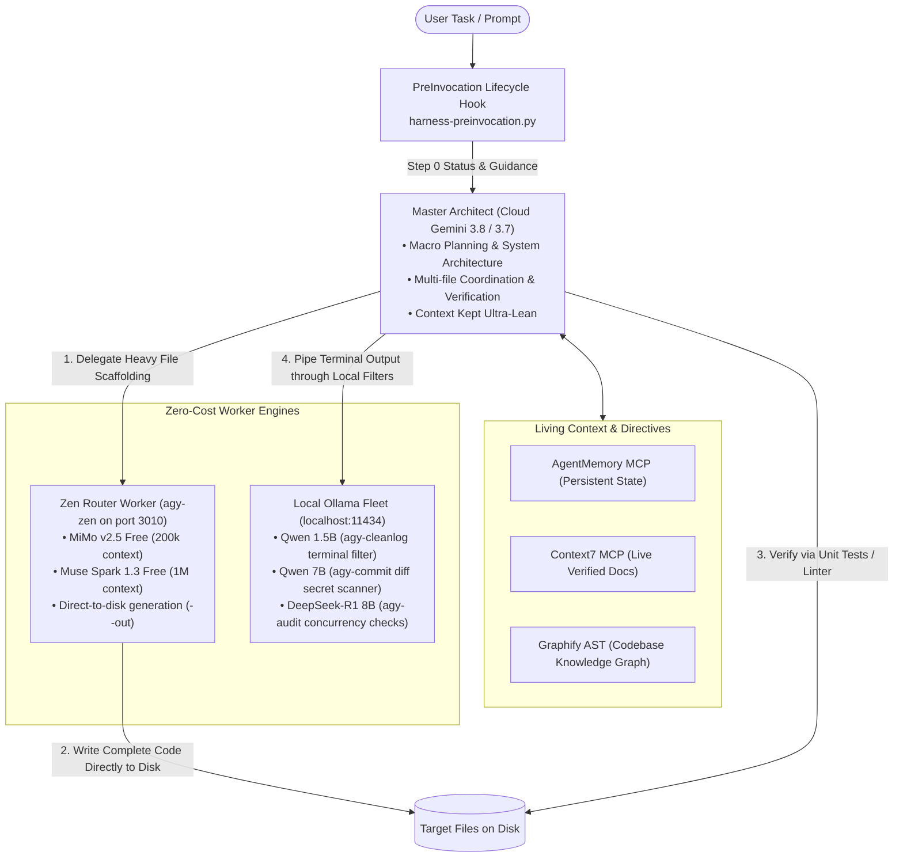

# 🪐 Antigravity Custom Harness Setup

[](LICENSE)
[](https://deepmind.google/technologies/gemini/)
[-green.svg)](https://github.com/ljskr1/antigravity-custom-harness-setup)
[-orange.svg)](https://ollama.ai)
[](skills/apple-design/SKILL.md)

> A production-grade **Autonomous Multi-Agent Runtime Harness** built on **Google Antigravity**. Implements a Master-Worker protocol: Cloud Gemini acts as the Master Architect, while a local Zen Router proxy (`mimo-v2.5-free`, `muse-spark-1.3`, `deepseek-v4-flash`) and Ollama fleet handle heavy code generation, diff audits, and log compression with **zero cloud token waste**.

---


---

## 🏛️ System Architecture & Master-Worker Protocol

Rather than dumping massive file outputs and raw multi-agent transcripts into Cloud Gemini (which causes context exhaustion), this harness establishes a strict **Context Firewall**:



---

## ⚡ The 4 Pillars of the Harness

### 1. The Zen Router Worker Engine (`agy-zen`)
Running on `http://localhost:3010`, your local Zen Router proxy connects to free upstream models (`mimo-v2.5-free`, `muse-spark-1.3-contributor-free`, `deepseek-v4-flash-free`) with automatic key rotation and fallback:
- **Direct-to-Disk Generation**: AGY commands `agy-zen --prompt "..." --out src/service.ts`. The worker outputs code directly onto disk.
- **Zero Context Bloat**: Gemini’s context window never receives the 500-line code dump, consuming only ~150 tokens to orchestrate what would otherwise cost 6,000+ tokens.
- **1M Token Context**: Leverage `muse-spark-1.3-contributor-free` for massive codebase summarization without paying cloud fees.

### 2. Local Ollama Specialist Fleet & Auto-Healing
- **`agy-cleanlog`** *(Qwen 1.5B)*: Strips build noise and progress bars, distilling megabyte-sized terminal failures down to <12 lines.
- **`agy-commit`** *(Qwen 7B)*: Audits staged git diffs for forgotten debug statements (`console.log`, secrets) and drafts Conventional Commits.
- **`agy-audit`** *(DeepSeek-R1 8B)*: Runs deep reasoning on tricky multithreading, deadlocks, and race conditions.
- **Auto-Healing**: The pre-invocation hook automatically starts Ollama in the background if stopped.

### 3. Living Self-Learning Directive & Deterministic Lifecycle Hooks
- **PreInvocation Hook (`harness-preinvocation.py`)**: Runs before every model turn in <30ms, probing Ollama and Zen Router status and injecting mandatory Step 0 guidance.
- **AgentMemory (`agentmemory` MCP)**: Retains durable architectural decisions and preferences across sessions.
- **Live Documentation (`Context7` MCP)**: Fetches version-exact, real-time documentation snippets for fast-evolving packages (Next.js, Tailwind, Supabase) to eliminate API hallucination.
- **Codebase Knowledge Graph (`Graphify`)**: Converts source code into an offline AST graph (`graphify query`, `graphify path`).

### 4. Apple Design System & Compliance Audit Engine
- **Native Apple HIG**: SF Pro / New York optical scales, G2 squircle continuity, dynamic OLED colors, and physical spring physics (`cubic-bezier(0.25, 1, 0.5, 1)`).
- **Apple Web Gallery Standard**: Photography-first museum gallery architecture, pure black global nav (`#0066cc` Action Blue), 17px body reading rhythm (1.47 line-height), and the single signature product surface drop shadow (`rgba(0, 0, 0, 0.22) 3px 5px 30px`).
- **Automated 0–100 Audit CLI (`audit-apple-design.mjs`)**: Static scanner verifying WCAG relative luminance contrast ratios (≥ 4.5:1) and touch-target dimensions (≥ 44×44 pt).

---

## 🚀 Quickstart & Setup

### Prerequisites
- [Google Antigravity CLI or IDE](https://antigravity.google)
- [Zen Router Proxy](https://github.com/ljskr1/antigravity-custom-harness-setup) on port 3010
- [Ollama](https://ollama.ai) on port 11434

### 1. Install CLI Helpers
```bash
cp scripts/agy-zen ~/.local/bin/agy-zen
cp scripts/agy-helpers.zsh ~/.local/bin/agy-helpers.zsh
chmod +x ~/.local/bin/agy-zen ~/.local/bin/agy-helpers.zsh
echo 'source ~/.local/bin/agy-helpers.zsh' >> ~/.zshrc
source ~/.zshrc
```

### 2. Configure PreInvocation Hook
```bash
cp scripts/harness-preinvocation.py ~/.gemini/config/hooks/harness-preinvocation.py
cp config/hooks.example.json ~/.gemini/config/hooks.json
chmod +x ~/.gemini/config/hooks/harness-preinvocation.py
```

### 3. Generate Code via Free Zen Worker
```bash
# Generate file directly onto disk with zero cloud tokens
agy-zen --model mimo-v2.5-free --prompt "Write a FastAPI auth router with JWT" --out src/auth.py
```

---

## 🛡️ Security & Zero-Leak Assurance
- **No Hardcoded Secrets**: All API keys, bearer tokens, and OAuth keys are substituted with environment variables (`${RENDER_API_KEY}`, `${GOOGLE_API_KEY}`).
- **Sanitized Paths**: No user-specific home directory paths exist in committed configs.
- **Hardened `.gitignore`**: Automatically blocks `.env*`, `.token`, credentials, local SQLite databases, and transient caches.

---

## 📄 License
This project is open-source under the [MIT License](LICENSE).
