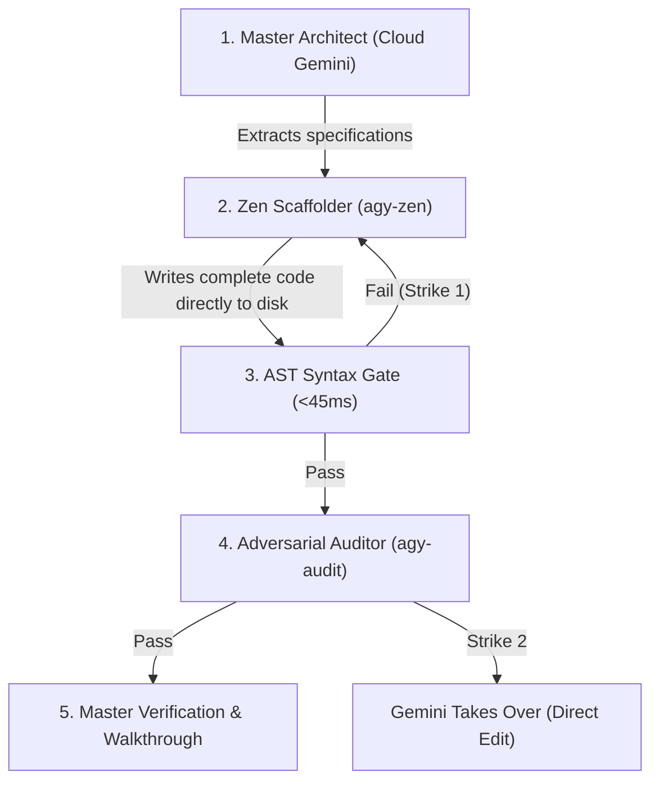

# Zen Team — Zero-Token Multi-Agent Fleet Protocol

The `/zen-team` command provides an autonomous, two-phase multi-agent development workflow that mirrors Google's native `/teamwork-preview`, but routes code generation, multi-file analysis, and quality audits through **local Zen Router models** (`mimo-v2.5-free`, `muse-spark-1.3-contributor-free`) and the **local Ollama fleet** (`deepseek-r1:8b`, `qwen2.5-coder:7b`).

---

## When to Use `/zen-team` vs `/teamwork-preview`

| Feature | Native `/teamwork-preview` | `/zen-team` (Zen Router + Ollama) |
| :--- | :--- | :--- |
| **Engine** | Google Cloud Gemini 3.8 Flash Subagents | Local Zen Router + Local Ollama Fleet |
| **Cloud Token Cost** | High (Passes full context through cloud) | **Near-Zero ($0.00 worker tokens)** |
| **Quota Risk** | Risk of 429 quota exhaustion on large runs | **Zero 429 quota risk** |
| **Execution Path** | Cloud subagent hierarchy (`.agents/`) | CLI-driven disk generation & AST gates |
| **Best For** | High-level research & exploratory RFCs | Heavy code builds, boilerplate, refactors, audits |

---

## Two-Phase Interactive Workflow

Like `/teamwork-preview`, `/zen-team` operates in two distinct phases:

### Phase 1: Interactive Prompt Crafting & Scope Definition
When `/zen-team` is triggered, immediately maintain a **`zen_draft.md` artifact** to track requirements, verification mechanisms, and acceptance criteria:

```markdown
# Zen Team Project Prompt — Draft

> Status: Drafting — awaiting user approval
> Master Architect: Cloud Gemini 3.8 Flash
> Worker Engine: Zen Router (mimo-v2.5-free / muse-spark-1.3-contributor-free)
> Quality Auditor: Local Ollama (deepseek-r1:8b)
> Working Directory: [Absolute Path]

[1-2 sentence project description]

## Requirements

### R1. [Deliverable 1]
[What is needed, specification density, types, boundary invariants]

### R2. [Deliverable 2]
[What is needed, constraints, error handling]

## Verification Mechanisms
- Deterministic Syntax Check: `bun build --no-bundle <file>` or `python3 -m py_compile <file>`
- Test Suite: `npm test` or `pytest`
- Adversarial Audit: `agy-audit <file>`

## Acceptance Criteria
- [ ] [Objective, checkable condition 1]
- [ ] [Objective, checkable condition 2]

---
*Status: Ready for launch — awaiting user approval ("go", "launch", "looks good")*
```

Present `zen_draft.md` to the user. Do **not** begin file generation until the user confirms readiness (`"go"`, `"launch"`, `"run it"`).

---

## Phase 2: Zen Fleet Execution Protocol

Once the user approves the draft:
1. Update `zen_draft.md` status to **`Status: Launched — Zen Fleet Executing`**.
2. Execute the autonomous 4-stage pipeline via `run_command`:



### Stage 1: Zen Worker Code Generation (`agy-zen`)
Do NOT output large code blocks in cloud turns. Delegate file generation directly to disk using `agy-zen`:
```bash
agy-zen --model mimo-v2.5-free --prompt "<detailed requirements with explicit types & invariants>" --out <path/to/target/file>
```
For large multi-file refactors or deep contextual input:
```bash
agy-zen --model muse-spark-1.3-contributor-free --file <context-file> --prompt "<requirements>" --out <target-file>
```

#### The Prompt Contract Protocol (Contract-Level Worker Prompting)
Small and free worker models (`qwen2.5-coder:7b`, `mimo-v2.5-free`) are literal code executors that default to generic training habits unless constrained. **Do NOT economize on instruction depth from Cloud Gemini**. Spending 300–500 cloud tokens to provide an exhaustive, contract-level prompt achieves 95%+ first-pass success:
1. **Explicit DOM & State Contracts**: Specify exact HTML element IDs, `data-*` attributes (e.g., `data-segment="<name>"`), classes, and matching JavaScript event handlers and query selectors so the worker never desynchronizes markup from script.
2. **Negative Constraints ("NEVER" Rules)**: Explicitly forbid bad training defaults:
   - e.g., *"NEVER reduce touch targets below 44×44pt in media queries."*
   - e.g., *"NEVER use linear or ease-in-out transitions for interactive controls."*
   - e.g., *"NEVER omit accessibility roles (role='tablist', role='tab', aria-selected) or unhandled error states."*
3. **Exact Mathematical & Physics Tokens**: Supply concrete CSS cubic-bezier curves (e.g., `cubic-bezier(0.25, 1, 0.5, 1)`), exact diffused shadow opacities (alpha ≤ 0.28), and exact typography stacks directly in the prompt so the worker never guesses.


### Stage 2: Deterministic AST & Compiler Gate (<45ms)
Immediately compile and validate the generated file before reading it back to cloud context:
- **TypeScript / JavaScript**: `bun build --no-bundle <file>`
- **Python**: `python3 -m py_compile <file>`
- **JSON**: `python3 -m json.tool <file> > /dev/null`

**The 2-Strike Escalation Gate**:
- **Strike 1**: If the file fails compilation, issue one surgical correction prompt to `agy-zen` with the compiler stderr trace.
- **Strike 2**: If the file fails verification a second time, **Cloud Gemini takes over immediately** and edits the file directly. Never enter infinite loops.

### Stage 3: Adversarial Quality Audit (`agy-audit`)
Run an offline logic, concurrency, and edge-case audit using local `deepseek-r1:8b`:
```bash
agy-audit <path/to/target/file>
```
If potential edge cases or bugs are surfaced, resolve them deterministically.

### Stage 4: Test Suite & Final Verification
Run the project's existing test suite or verify functionality:
```bash
npm test 2>&1 | agy-cleanlog
```

---

## Deliverables & Walkthrough
Upon completion:
1. Update `zen_draft.md` status to **`Status: Complete — 100% Verified`** with all checkboxes ticked.
2. Present a concise [walkthrough.md](file:///Users/lijah/.gemini/antigravity/brain/2ac444ac-c4f1-447c-8a8f-18c55a75190a/walkthrough.md) showing:
   - Files generated and modified
   - Verification commands executed and test passes
   - Cloud tokens saved (estimated based on generated code size)
